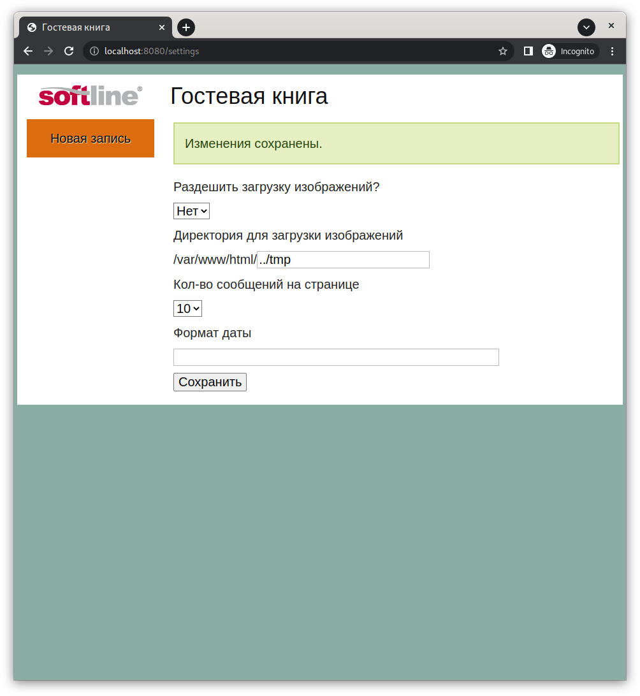

phpGuestbook
============

Гостевая книга была разработана для сдачи тестового задания в январе 2011 года в компанию Softline (http://softline.ru/)

Возможности
---------------

- Добавление записей
- Постраничкая навигация
- Загрузка изображений
- Хранение изображений в базе данных
- Имеет страницу настроек

Установка при помощи Docker
---------------------------

    docker-compose up

Скриншоты
---------

